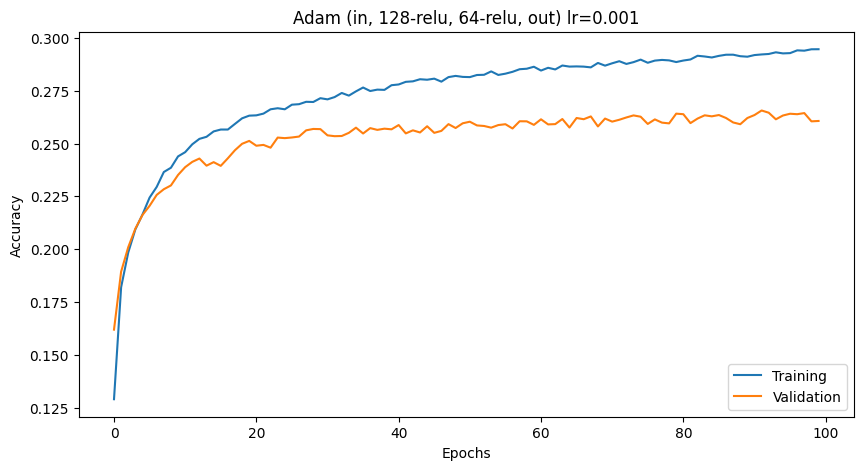

# Spotify Dataset Analysis - Team VHKTB
### CS M148 Project
### Team Members
- Victoria Vu
- Tejas Kamtam
- Kai (Kyle) Xu
- Brendan Lao
- Helen Feng

---

## Project Overview

### The Dataset

### The Problem

### Methodology

### Results

### Development Guide

---

## Appendix

### EDA

### Feature Engineering

### Regression

### Logistic Regression

### K-Nearest Neighbors, Decision Trees, and Random Forests

### PCA and Clustering

### Neural Network

Due to the complexity of our classification problem, we decided to approach it with an MLP. We attempted classifying the feature `track_genre` using the following features as predictors:
```
'popularity', 'explicit', 'energy', 'loudness', 'speechiness',
'acousticness', 'instrumentalness', 'liveness', 'valence'
```

There are 114 unique genres present in the dataset and contains roughly 114k samples.
We used a 60-20-20 train-validation-test split with 42-seeded randomization. Additionally, we preformed standardization to reduce computation cost and normalize the sample distribution at 0.

Our final MLP consisted of **2 hidden layers both with 128 neurons**. We performed ReLU activation at each hidden layer. We trained the model using the Adam optimizer with a **learning rate of 0.001** and a **weight decay of 0.001** to combat overfitting observed in "Relevant Test 1" below for **100 epochs** using a **batch size of 100** optimizing for the Cross-Entropy loss (the PyTorch implementation of the cross entropy loss operates on the logits of the model so we do not require a final softmax activation). This resulted in the following epoch-loss curve:


and the following epoch-accuracy curve:


We achieved a best validation accuracy of approximately **0.255**. See our comments below in "Relevant Test 2 (Final)" on why we beleive this is our best model and possibly the asymptotic limit of feed-forward or fully-connected/dense MLPs on this dataset.


### Hyperparameter Tuning

#### Relevant Test 0: SGD, (in, 64-relu, 64-relu, out), lr=0.001, momentum=0.9

We used mostly trial-and-error for hyperparameter training, using our knowledge of optimizers, activation functions, and learning rates.

One of our initial trials, quite different to our optimal model, consisted of a 2 hidden layers, each with 64 neurons with ReLU activation. We used the SGD optimizer with a learning rate of 0.001 and a momentum of 0.9. This resulted in the following epoch-loss-accuracy curves, trained for 100 epochs:


From these visualizations, we can see that the model is underfitting as accuracy and loss tend to optimize as the number of epochs increase and the train-val curve does not diverge or "elbow" out. Because the learning rate and momentum are already pretty aggressive, we chose to modify the model architecture and activations instead of optimizer hyperparameters. Additionally, the SGD optimizer tended to converge significantly slower than the Adam optimizer, which was supported by some external insight into SGD's classification performance in a low number of epochs.

#### Relevant Test 1: Adam, (in, 128-relu, 64-relu, out), lr=0.001

This was our first significant test migrating to the Adam optimizer. We found that the Adam optimizer was able to converge much faster than the SGD optimizer, and resulted in a higher initial accuracy. This resulted in the following epoch-loss-accuracy curves, trained for 100 epochs:




From these visualizations, we can see that the model is overfitting as the validation accuracy diverges significantly from the training accuracy after the first 10 epochs. The loss also quickly converges to an asymptotic limit. This suggests that we can try regularization techniques to combat overfitting.


#### Relevant Test 2 (Final): Adam, (in, 128-relu, 128-relu, out), lr=0.001, weight_decay=0.001

In this test, we found that the base model using 128-64 hidden layers resulted in observable overfitting. We hypothesized that this was due to the large number of parameters in the model. To combat this, we added weight decay to the Adam optimizer while maintaining the aggressive learning rate of 0.001. We suspected that the weight decay may be too aggressive (as we were limited in resources to thoroguhly test a range of weight decay parameters), so we increase the number of parameters in the second hidden layer to 128. This resulted in the following epoch-loss-accuracy curves, trained for 100 epochs:


This model seemed to not overfit and the "learnable gap" between train and validation loss was much smaller than the previous model. Given this and the following tests, we beleive we've reached the asymptotic limit of our model and the dataset. More external research has hinted that we might be able to increase our classification performance by using a more complex model while introducing dropout or other regularization techniques.

#### Relevant Test 3: Adam, (in, 128-relu, 128-relu, out), lr=0.001, weight_decay=0.001, dropout=0.5

In this test, we built off the previous and added dropout (with a probability of 0.5) to each hidden layer. We built o nthe previous idea of increasing parameter regularization to decrease the model complexity in hopes of reducing overfitting while raising the upper bound. Unfortunately, as observed in the following graphs, this led to significant underfitting (as shown by the train-val gap) and a lower upper bound:


#### Relevant Test 4: Adam, (in, 128-relu, 256-relu, 128-relu, out), lr=0.001, weight_decay=0.001, dropout=0.3

In our final signifcant test, we attempted to increase model complexity to balance out the aggressive weight decay and dropout. We tuned the dropount down to 0.3 at each layer and modified the model architecture to have 3-hidden layers 128-256-128. This resulted in the following epoch-loss-accuracy curves, trained for 100 epochs:


This final test revealed that our attempts to decrease overfitting by increasing model complexity did indeed reduce the train-val gap, but did not raise the upper bound of our model. Although we could continue hyperparameter tuning with increasing the type of model, dropping conenctions (like a CNN, non-dense/FC), or other regularization techniques, we beleive we've reached the asymptotic limit of our model and the dataset in Relevant Test 2.

