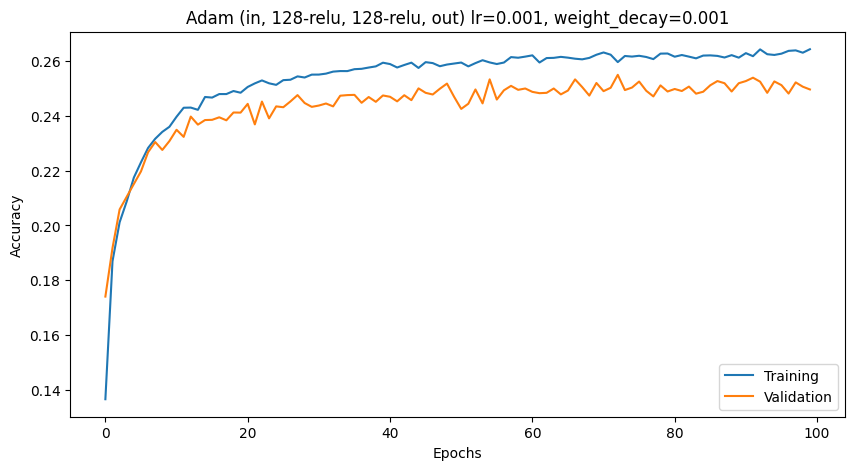

# Spotify Dataset Analysis - Team VHKTB
### CS M148 Project
### Team Members
- Victoria Vu
- Tejas Kamtam
- Kai (Kyle) Xu
- Brendan Lao
- Helen Feng

<h3><a href="https://docs.google.com/document/d/11k2JYRMdhVmeJLy7B-2L4Xoix3M2xOz0fum01emW6EY/edit?usp=sharing">Final Report (in migration to this README)</a></h3>

---

## Project Overview

### The Dataset

### The Problem

### Methodology

### Results

### Development Guide

---

## Appendix

### EDA

We initially conducted our EDA using domain knowledge and intuition and wanted to use popularity as our response variable. However after further research using correlation histograms and a heat map, we found that there was a much more significant variable in the data. This lead us to change our response variable to “track_genre,” which had a significantly higher correlation to the other numerical values such as the variables speechiness, danceability and instrumentalness.

There were two binary variables, explicitness and mode, which we created a correlation histogram for as well in order to see which was a better candidate. We based it on which had a stronger correlation to the other variables. We found that explicitness had the strongest correlations with the others, despite it only being a correlation of about 0.1-0.3. Considering the high dimensionality of the data, we considered this adequate enough to be a potential response variable. 

However, after testing those possible predictors, we realized that we were getting poor results for classification and optimizing for a specific metric like TPR seemed fruitless as the model would set a really low lower bound for the complex data. To combat this, we decided to use a more complex model like neural networks for a multi class classification task. The only viable variable for this was track_genre, due its higher correlation values compared to the other categorical variables. 

Finally, we did some PCA which we covered more in depth in another section.
For how we decided to split the data, there was no class imbalance for the different track genres as they all had 1000 instances. Therefore, we were able to do a classic 60/20/20 split for the training, validation and testing data sets without much adjustments. 


### Feature Engineering

In terms of data pre-processing and feature engineering, there were not many steps necessary to complete. The data only had one data point with invalid values. For example, there were no artist or song duration listed. We decided to drop it without any other steps because it was only one point.   The predictor variables we selected were already continuous numerical values so there were no encoding steps necessary. We also dropped one column that was titled “unnamed” as the usage was unclear.

We did some feature engineering steps for our clustering, PCA and final neural network. We chose to center the data by dividing by the standard deviation for the column as well as standardizing the data Finally, we encoded the categorical columns using the label encoder. 


### Regression

From the EDA, we explored ‘instrumentalness’ as a predictor for popularity of a song in regression analysis, as it appeared to be the strongest numerical predictor for popularity with a strong negative correlation. To evaluate this, we trained two regression models: Least Squares (LS) and Least Absolute Deviations (LAD)

The models were trained on 60% of the data, since we split the data in 60% 20% 20% partitions for training, validation, and testing respectively. While we considered stratified sampling, the possible strata were evenly represented in the given data, so we used random sampling. 
The metrics of the models are as follows:

#### Least Squares
LS rMSE: 25.743319712449924\
LS MAE: 20.738647006185452\
LS MAD: 17.544400787197837\
LS correlation: 0.09664267153037186\
LS R2: -0.3305786084395481

#### Least Absolute Deviation
LAD rMSE: 26.143775727936724\
LAD MAE: 21.05688895750487\
LAD MAD: 17.999999999999993\
LAD correlation: 0.09664267153037177\
LAD R2: -0.3722968138831475

LAD had higher scores, but both LS and LAD have low R² Values -0.33 and -0.37. This shows that the model is not able to capture a relationship between the predictor and the target and that it performs worse than average. In addition, a correlation coefficient of 0.0966 for both models suggests a very weak linear relationship between the two. Finally, both RMSE and MAE are high, showing high deviation from the prediction to the real values. All of these point to underfitting.
From this analysis, we learned that both LS and LAD models demonstrated low performance in predicting popularity based on 'instrumentalness' alone. This suggests that 'instrumentalness' was not a strong predictor of popularity on its own.
We also attempted to apply Lasso regularization to our models. However, since our models were already appearing to be underfitting, regularization did not significantly impact the effectiveness of the model since it is a technique to reduce overfitting. As such, regularization was not needed

### Logistic Regression

For binary classification, we explored predicting whether or not a song was explicit based on speechiness, danceability, and instrumentalness. To do this, we trained a logistic regression model to predict our result using these three predictors using 80% of the data we had (using an 80-20 train-test split). After training, we optimized some parameters to minimize errors. More specifically, to minimize false positive rate and maximize the true positive rate (TPR), we found the best threshold to be 0.09536726733599304, above which we classified a probability to correspond to an explicit song, instead of the default 0.5. 
We used a variety of metrics to measure the effectiveness of our model. 

	The AUC score was 0.76, suggesting that our model had good predictive power and distinguishing whether or not a song is explicit. The model accurately predicted most of both the positive and negative samples, yielding a good TPR and TNR (true negative rate). We also found the metrics for this prediction:
Prediction accuracy: 0.7889473684210526
Prediction error: 0.21105263157894738
True positive rate: 0.6044303797468354
True negative rate: 0.8056831228473019

To test the robustness of the model, we use 5-fold cross validation and observe the model’s performance across each fold. The results are as follows:
Fold 1
AUC score: 0.805788592761281
Accuracy score: 0.7791666666666667
Fold 2
AUC score: 0.7783097296242913
Accuracy score: 0.7414473684210526
Fold 3
AUC score: 0.6485269138535326
Accuracy score: 0.7792105263157895
Fold 4
AUC score: 0.744357806062842
Accuracy score: 0.7933771929824561
Fold 5
AUC score: 0.8028599183249604
Accuracy score: 0.7855607702092197
As shown, the model did a decent job of predicting whether or not a song was explicit, and found high correlation between our predictors and the explicitness. While this makes sense for a song to be explicit the more “speechy” it is, the data supports this seemingly ordinary observation. While we considered performing regularization, we found the training accuracy (about 0.91) wasn’t off from our validation accuracy. As such, we did not see extreme signs of overfitting and deemed it unnecessary.
 

### K-Nearest Neighbors, Decision Trees, and Random Forests

Using KNN, decision trees, and RF, we sought out to classify songs as either explicit or not explicit.  After analyzing the data, we observed a significant class balance with only 9.3% of results being explicit.  Therefore, we lowered our threshold to 0.093.  The features with the highest absolute correlation with explicitness were speechiness, danceability, and instrumentalness, so we used these as the features for the model.  We initialized a KNN model with the number of neighbors equal to 4.  This parameter was decided by using cross validation on a KNN model with k ranging from 1 to 10.  A k of 2 actually yielded the best cross validation score, but a k of 2 was too small and likely overfitted the model to the data set, so we settled on 4.  To determine the best hyperparameters (min_samples_split and max_depth) for CART, the same process was repeated, once for min_samples_split and once for max_depth, with cross_val_score being used to evaluate each model.  The optimal parameters we settled on were a min_samples_split of 70 and a max_depth of 9.  The accuracy, TPR, TNR, and AUC were obtained for all of these models in the table below.
Judging from the results, we can see that random forest (RF) had the highest accuracy, TPR, and AUC.  For applications such as content moderation, correctly identifying a song as explicit was most important, so we chose the model with the largest true positive rate (TPR).  RF performed best here, with a TPR of 74.2% compared to CART with a TPR of 63.9% and KNN, with a TPR of 67.9%.  However, the f1 score was poor at 0.412, possibly because of the large class imbalance.  Due to its ensemble nature, random forest was able to combine multiple decision trees in order to create a classification model that captured many complex relationships in the data without overfitting.  In comparison, based on the metrics for the CART and KNN models, they did not appear complex enough to adequately capture all of the relationships in the data, solidifying our choice to use RF for binary classification.

In order to analyze the robustness of our model, we performed 5 fold cross validation. AUC measurements had an average of 0.801, accuracy had an average of .927, and f1 had an average of 0.393.  The metrics remained consistent throughout the crossfolds, suggesting generalizability, but the disparity in accuracy and f1 score suggests that the class imbalance is affecting our model.


### PCA and Clustering
We sought out to see if different genres had similarities that we could identify using hierarchical clustering and k means clustering.  This has applications for song recommendations, as those who listen to a certain genre are more likely to enjoy similar genres.  In choosing the number of clusters, we experimented with many different numbers of clusters between 5-9 and settled on 8 based on silhouette score analysis.  There was not a significant difference between each cluster in regard to silhouette score.  

According to the data, 6 clusters had the highest silhouette score, but with a difference of approximately 0.02, we opted to use 8 since possible groups include: aggressive (dubstep, heavy metal, trap, etc.), pop (pop edm, regular pop, indie, etc.), instrumental (guitar, piano, etc.), chill (lofi, chillstep), and club/dance (deep house, tech house, melodic house etc.), which makes 5 groups with an additional 3 to reveal other relationships in the data that we have not considered.  After running hierarchical clustering and k-means clustering on the raw data, the metrics were as follows:

1. K-means Inertia: 80145.9
2. Hierarchical Clustering WSS: 87389.6
3. K-means Silhouette Score: 0.149
4. Hierarchical Clustering Silhouette Score: 0.115
5. Rand Index (K-means vs Hierarchical): 0.824
6. Adjusted Rand Index (K-means vs Hierarchical): 0.397

With a silhouette score for k-means of 0.149 and a silhouette score for hierarchical clustering of 0.115, this indicated that each cluster had a good amount of overlap due to how close the magnitude is to 0.  Visually, the graphs appear to support this as the clusters do not appear very defined with a lot of overlap between each cluster.  Additionally, the WSS for k-means and hierarchical clustering were quite high with both being above 80,000, but it makes sense for it to be relatively large since the dataset included 12,000 points.  A rand index of .824 suggested good agreement between the clustering algorithms, but an ARI of 0.397 suggested that this may be due to random chance.  Therefore, we decided to use PCA to see if it would yield better results by reducing noise in the dataset.  Using PCA, we utilized PC1 and PC2, which explained 88% of the variability in the data.  Adding further PCs such as PC3 only contributed <2% extra variability, so we opted to stop at PC2.  The scree plot supported this choice as the elbow occurred between PC1 and PC2.  These 2 PCs were used to transform the original data set, and when plotting PC1 against PC2, no significant structure was observed as all the points were in a single large cluster.
Consequently, we decided to run k-means and hierarchical clustering on the PC transformed data to determine if it would yield a better clustering.  The metrics were as follows:
1. K-means Inertia: 7120.7
2. Hierarchical Clustering WSS: 8018.5
3. K-means Silhouette Score: 0.323
4. Hierarchical Clustering Silhouette Score: 0.273
5. Rand Index (K-means vs Hierarchical): 0.869
6. Adjusted Rand Index (K-means vs Hierarchical): 0.51

Performing a PCA transform before clustering did yield better results, with a silhouette score for k-means of 0.323 and for hierarchical clustering of 0.237.  This suggested that each of the clusters had less overlap between each other compared to the original data, and the clusters were more separated.  Additionally, the rand index improved from 0.824 to 0.869, which is a small improvement,  However, larger gains were observed in the adjusted rand index, which improved from .397 to .51, suggesting stronger agreement between the two clustering algorithms when accounting for pure chance.  The WSS decreased significantly from approximately 80000 to 7120 for k-means and 8018 for hierarchical clustering, but the data was standardized prior to performing PCA in addition to dimensionality reduction, which explains this improvement in WSS.  
Among each cluster, they seemed to yield interesting results.  One such cluster grouped heavy metal, punk, alt-rock, and dubstep, all of which are genres that involve lots of distortion and aggressive sound design.  Additionally, there was an instrumental cluster that included genres such as guitar, ambient, and piano, which makes sense since these genres have many acoustic elements and do not typically include lyrics.  An explanation for the low silhouette score and relatively high WSS is that many different genres tend to share similar elements.  For example, many dubstep songs such as Gold or Feel Something by Illenium include acoustic guitars in addition to electric guitars, and these are elements that are also present in regular guitar genre music.  Genres such as drum and bass and house were clustered differently and differ in their energy levels (drum and bass tends to be high energy due to higher bpm >150 and house tends to be lower in energy due to bpm averaging around 128), but both have an emphasis on percussive elements such as hi-hats, snares, and claps which are carefully mixed to shine through the rest of the mix.  Therefore, it makes sense that the clustering algorithms did not generate such a high silhouette score since many different genres share many similar elements.  


### Neural Network

Due to the complexity of our classification problem, we decided to approach it with an MLP. We attempted classifying the feature `track_genre` using the following features as predictors:
```
'popularity', 'explicit', 'energy', 'loudness', 'speechiness',
'acousticness', 'instrumentalness', 'liveness', 'valence'
```

There are 114 unique genres present in the dataset and contains roughly 114k samples.
We used a 60-20-20 train-validation-test split with 42-seeded randomization. Additionally, we preformed standardization to reduce computation cost and normalize the sample distribution at 0.

Our final MLP consisted of **2 hidden layers both with 128 neurons**. We performed ReLU activation at each hidden layer. We trained the model using the Adam optimizer with a **learning rate of 0.001** and a **weight decay of 0.001** to combat overfitting observed in "Relevant Test 1" below for **100 epochs** using a **batch size of 100** optimizing for the Cross-Entropy loss (the PyTorch implementation of the cross entropy loss operates on the logits of the model so we do not require a final softmax activation). This resulted in the following epoch-loss curve:


and the following epoch-accuracy curve:



We achieved a best validation accuracy of approximately **0.255**. See our comments below in "Relevant Test 2 (Final)" on why we beleive this is our best model and possibly the asymptotic limit of feed-forward or fully-connected/dense MLPs on this dataset.


### Hyperparameter Tuning

#### Relevant Test 0: SGD, (in, 64-relu, 64-relu, out), lr=0.001, momentum=0.9

We used mostly trial-and-error for hyperparameter training, using our knowledge of optimizers, activation functions, and learning rates.

One of our initial trials, quite different to our optimal model, consisted of a 2 hidden layers, each with 64 neurons with ReLU activation. We used the SGD optimizer with a learning rate of 0.001 and a momentum of 0.9. This resulted in the following epoch-loss-accuracy curves, trained for 100 epochs:


From these visualizations, we can see that the model is underfitting as accuracy and loss tend to optimize as the number of epochs increase and the train-val curve does not diverge or "elbow" out. Because the learning rate and momentum are already pretty aggressive, we chose to modify the model architecture and activations instead of optimizer hyperparameters. Additionally, the SGD optimizer tended to converge significantly slower than the Adam optimizer, which was supported by some external insight into SGD's classification performance in a low number of epochs.

#### Relevant Test 1: Adam, (in, 128-relu, 64-relu, out), lr=0.001

This was our first significant test migrating to the Adam optimizer. We found that the Adam optimizer was able to converge much faster than the SGD optimizer, and resulted in a higher initial accuracy. This resulted in the following epoch-loss-accuracy curves, trained for 100 epochs:


From these visualizations, we can see that the model is overfitting as the validation accuracy diverges significantly from the training accuracy after the first 10 epochs. The loss also quickly converges to an asymptotic limit. This suggests that we can try regularization techniques to combat overfitting.


#### Relevant Test 2 (Final): Adam, (in, 128-relu, 128-relu, out), lr=0.001, weight_decay=0.001

In this test, we found that the base model using 128-64 hidden layers resulted in observable overfitting. We hypothesized that this was due to the large number of parameters in the model. To combat this, we added weight decay to the Adam optimizer while maintaining the aggressive learning rate of 0.001. We suspected that the weight decay may be too aggressive (as we were limited in resources to thoroguhly test a range of weight decay parameters), so we increase the number of parameters in the second hidden layer to 128. This resulted in the following epoch-loss-accuracy curves, trained for 100 epochs:


This model seemed to not overfit and the "learnable gap" between train and validation loss was much smaller than the previous model. Given this and the following tests, we beleive we've reached the asymptotic limit of our model and the dataset. More external research has hinted that we might be able to increase our classification performance by using a more complex model while introducing dropout or other regularization techniques.

#### Relevant Test 3: Adam, (in, 128-relu, 128-relu, out), lr=0.001, weight_decay=0.001, dropout=0.5

In this test, we built off the previous and added dropout (with a probability of 0.5) to each hidden layer. We built o nthe previous idea of increasing parameter regularization to decrease the model complexity in hopes of reducing overfitting while raising the upper bound. Unfortunately, as observed in the following graphs, this led to significant underfitting (as shown by the train-val gap) and a lower upper bound:


#### Relevant Test 4: Adam, (in, 128-relu, 256-relu, 128-relu, out), lr=0.001, weight_decay=0.001, dropout=0.3

In our final signifcant test, we attempted to increase model complexity to balance out the aggressive weight decay and dropout. We tuned the dropount down to 0.3 at each layer and modified the model architecture to have 3-hidden layers 128-256-128. This resulted in the following epoch-loss-accuracy curves, trained for 100 epochs:


This final test revealed that our attempts to decrease overfitting by increasing model complexity did indeed reduce the train-val gap, but did not raise the upper bound of our model. Although we could continue hyperparameter tuning with increasing the type of model, dropping conenctions (like a CNN, non-dense/FC), or other regularization techniques, we beleive we've reached the asymptotic limit of our model and the dataset in Relevant Test 2.

